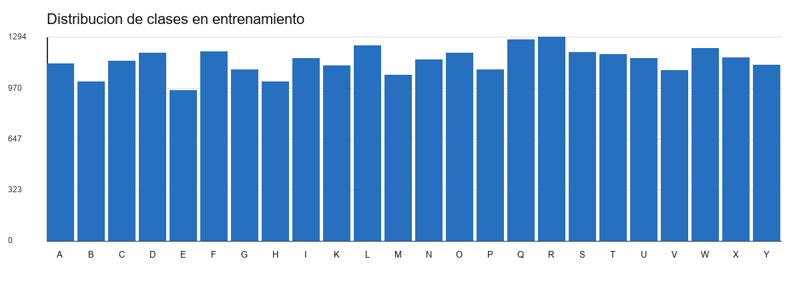
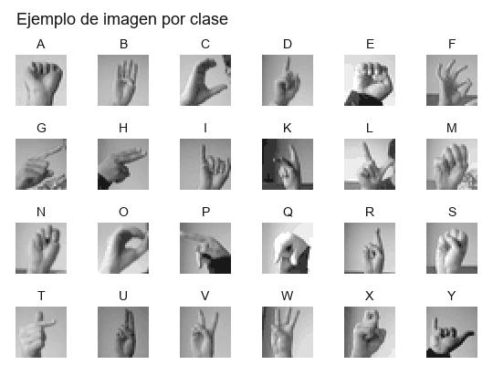
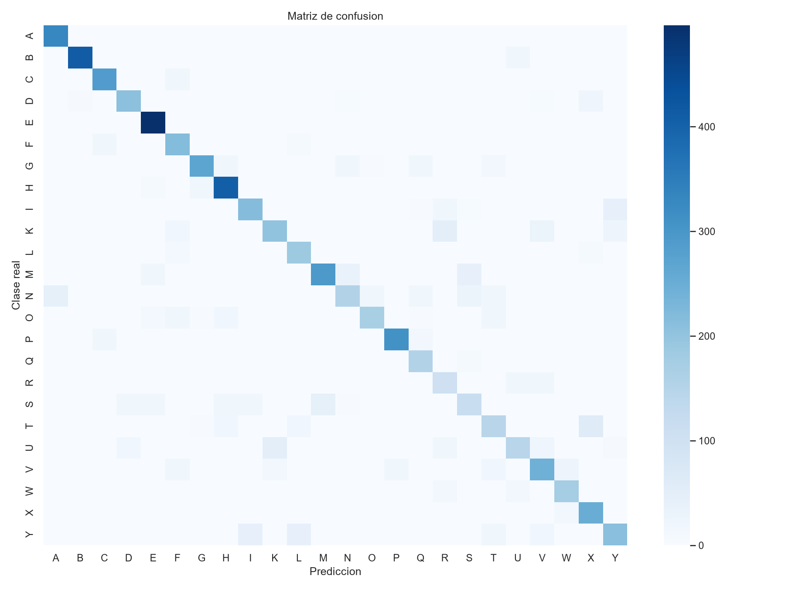
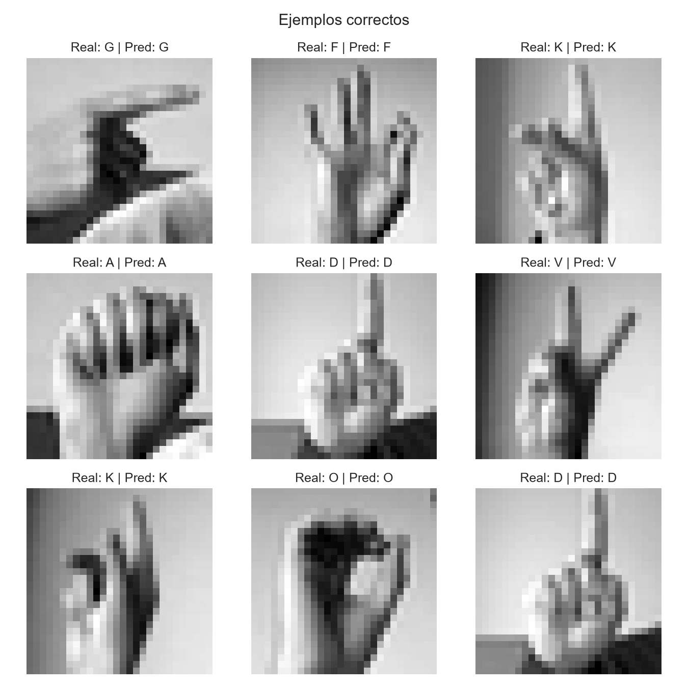
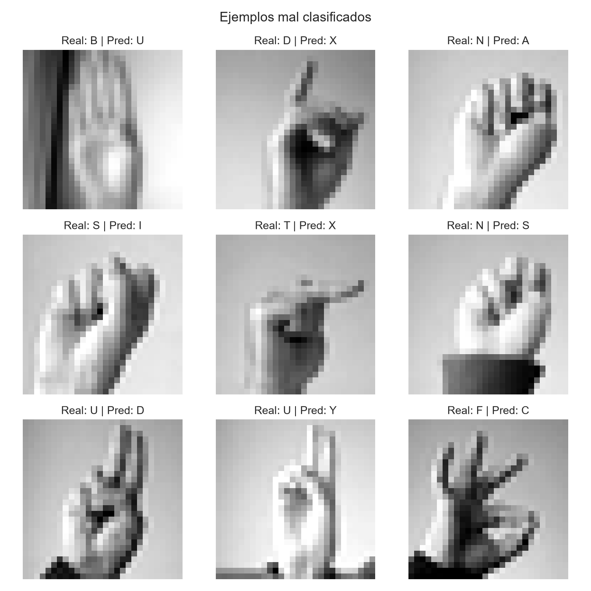

# Clasificación de letras de ASL con un perceptrón multicapa

**Evaluación Parcial 1 de TLY1102**

**Integrantes:** Gonzalo Castillo, Jenaro Marín y Jason

**Docente y sección:** [COMPLETAR]

**Fecha de entrega:** [COMPLETAR]

## Reparto para completar el informe

**El aporte de Jenaro está desarrollado en las secciones 8 y 9.** Incluye la
arquitectura, justificación de activaciones y pérdida, hiperparámetros,
entrenamiento, comparación, lectura de curvas y selección por validación.

Gonzalo y Jason deben revisar y completar los apartados asignados a continuación.
El texto que ya aparece en sus secciones es una base con las evidencias disponibles:
cada responsable debe completar su explicación y comprobar que coincida con el
notebook. El estado de esta tabla corresponde a la redacción del informe, no a la
existencia del código de cada integrante, que ya está integrado en el repositorio.

| Responsable | Secciones a cargo | Qué debe cerrar |
| --- | --- | --- |
| **Gonzalo Castillo** | 1 a 4, 5.1, 6 y 7 | Problema, variante propia acordada, objetivos, KPIs, referencia del dataset, calidad, CRISP-DM y justificación de la preparación |
| **Jenaro Marín** | **8 y 9** | **Aporte desarrollado:** MLP, entrenamiento, comparación y elección del modelo |
| **Jason** | 5.2 y 5.3, 10 a 13 | Interpretación de distribución e imágenes, métricas de test, matriz, aciertos, errores, limitaciones, impacto ético y conclusiones |
| **Todo el equipo** | Identificación, resumen, 14 y 15, anexos | Datos administrativos, síntesis final, referencias, revisión de reproducción y ensayo |

**Gonzalo:** completar la variante y la procedencia del dataset, explicar las
decisiones de preparación y verificar los resultados de calidad dentro del notebook.
**Jason:** desarrollar la lectura de las métricas y de casos concretos, distinguir
hipótesis de causas demostradas y cerrar las conclusiones del caso.
Al terminar, retirar las notas de trabajo y actualizar las casillas del anexo B.

## Resumen

> **Equipo:** revisar esta síntesis después de completar los apartados de Gonzalo y Jason.

Desarrollamos un clasificador de imágenes de letras estáticas de ASL con el dataset Sign Language MNIST, aprobado por el profesor para este proyecto. El trabajo aplica los contenidos de perceptrón, redes Fully Connected, descenso del gradiente y evaluación de modelos vistos en clases. Su finalidad es comprender y explicar el flujo de aprendizaje supervisado, además de medir el desempeño obtenido.

Comparamos tres MLP con la misma preparación de datos y el mismo protocolo de entrenamiento. La configuración de 512, 256 y 128 neuronas ocultas obtuvo el mejor F1 macro de validación y se seleccionó antes de evaluar el test oficial. En test alcanzó **79,71% de accuracy y 0,7760 de F1 macro**, frente a 100% de accuracy en validación. La diferencia de 20,29 puntos porcentuales muestra que la validación interna fue optimista respecto de ese test. El modelo aprende patrones útiles, pero sus errores y la desigualdad entre letras limitan su uso como apoyo educativo fuera de las condiciones evaluadas.

El informe presenta el problema, las decisiones de preparación y modelado, la interpretación de los resultados y las instrucciones para reproducir el proyecto. El anexo final reúne las comprobaciones pendientes antes de entregar.

## 1 Descripción del problema de negocio

> **Gonzalo — completar:** concretar el usuario beneficiado, justificar el dataset y cerrar la variante propia en 1.2 con el equipo.

Una aplicación para practicar el alfabeto de ASL podría utilizar un clasificador que asigne una letra a la imagen de una mano. Esto permitiría ofrecer retroalimentación durante ejercicios de reconocimiento. En esta primera etapa estudiamos si una red MLP puede resolver esa clasificación y qué errores habría que considerar antes de utilizarla con estudiantes.

La entrada es una imagen de 28 × 28 píxeles en escala de grises. La salida es una de las 24 letras presentes en el dataset. Es un problema de aprendizaje supervisado y clasificación multiclase: cada ejemplo incluye una etiqueta conocida y pertenece a una única clase.

El alcance comprende la clasificación de imágenes ya preparadas. No se implementa una aplicación con cámara, traducción de conversaciones ni reconocimiento de movimiento. Tampoco se evalúa lengua de señas chilena. La mejora del aprendizaje de usuarios sería un resultado de negocio relevante, pero este proyecto no realiza un estudio con personas que permita medirla.

### 1.1 Justificación del dataset

Sign Language MNIST permite practicar un flujo de imágenes con datos de tamaño manejable. Las imágenes tienen dimensiones homogéneas, etiquetas y un test oficial separado. Sus 784 píxeles se pueden utilizar como entrada de una red densa, lo que permite concentrarse en los fundamentos de MLP sin añadir una arquitectura fuera del alcance de esta experiencia.

La clasificación de letras visualmente parecidas también facilita analizar aciertos, confusiones y limitaciones. La aprobación del dataset está confirmada por el profesor.

### 1.2 Delimitación y variante del grupo

El experimento implementado utiliza las 24 clases disponibles, una partición estratificada con semilla 42 y la comparación de tres capacidades de MLP, manteniendo 20 épocas, batch de 128 y Adam con learning rate 0,001.

**[COMPLETAR VARIANTE PROPIA]** Registrar la variante específica acordada por el grupo y explicar qué la diferencia del problema general. La pauta menciona como posibilidades una selección de clases, un límite de ejemplos por clase, una semilla propia o una comparación entre subconjuntos. Usar las 24 clases describe el alcance, pero por sí solo no demuestra una diferenciación. La comparación de arquitecturas está realizada y debe describirse como tal, sin afirmar una variante de datos que no se haya implementado. Si la variante modifica los datos o la partición, deberán actualizarse el notebook, las métricas y las conclusiones correspondientes.

## 2 Objetivos del proyecto

> **Gonzalo — completar:** revisar que los objetivos correspondan al alcance y a la variante acordada, sin atribuir una aplicación real que no se construyó.

### 2.1 Objetivo general

Implementar y evaluar un modelo MLP para clasificar las 24 letras estáticas de Sign Language MNIST, justificando las decisiones de preparación, arquitectura y entrenamiento e interpretando sus resultados y limitaciones.

### 2.2 Objetivos específicos

- Describir las fuentes, la calidad y la distribución de los datos, identificando dificultades para la clasificación.
- Normalizar los píxeles, codificar las etiquetas y separar entrenamiento, validación y test con funciones distintas.
- Comparar tres configuraciones de capas densas bajo un protocolo común y seleccionar una mediante validación.
- Interpretar loss, accuracy, precision, recall, F1 y matriz de confusión, junto con ejemplos concretos de aciertos y errores.
- Documentar el procedimiento y organizar sus archivos para que otra persona pueda ejecutarlo y defender sus decisiones.

## 3 Definición de KPIs

> **Gonzalo — completar:** relacionar cada indicador con la utilidad del caso y justificar por qué se usan métricas macro. Coordinar con Jason la interpretación de sus valores finales.

Los siguientes indicadores técnicos permiten valorar la utilidad potencial del clasificador. No demuestran por sí solos una mejora del aprendizaje o de la accesibilidad de los usuarios.

| Indicador | Qué informa en este caso | Uso en el proyecto |
| --- | --- | --- |
| Accuracy | Proporción total de imágenes cuya letra se identifica correctamente | Resumir aciertos en validación y test |
| Precision por clase | De las imágenes predichas como una letra, cuántas corresponden realmente a ella | Detectar letras que el modelo predice en exceso |
| Recall por clase | De todas las imágenes reales de una letra, cuántas reconoce | Identificar letras que suelen quedar sin reconocer |
| F1 macro | Promedio del F1 de las 24 clases, dando el mismo peso a cada letra | Seleccionar la arquitectura en validación y complementar accuracy en test |
| Brecha de accuracy | Diferencia en puntos porcentuales entre validación y test | Describir cuánto cambia el desempeño entre conjuntos |
| Matriz de confusión | Relación entre letra real y letra predicha | Examinar dónde ocurren los errores |

Para una clase, precision = TP / (TP + FP), recall = TP / (TP + FN) y F1 = 2 × precision × recall / (precision + recall). TP son aciertos de esa clase, FP son predicciones incorrectamente asignadas a ella y FN son ejemplos de esa clase asignados a otra. Accuracy cuenta los aciertos globales. F1 macro promedia el F1 de cada clase, por lo que ayuda a detectar un desempeño desigual aunque algunas letras tengan más ejemplos.

El criterio experimental prioriza el mayor F1 macro de validación. No se fijó un umbral de aceptación para desplegar una aplicación real. Por ello, no corresponde declarar éxito comercial a partir de un porcentaje elegido después de observar el test. La pérdida se utiliza para interpretar el aprendizaje, aunque no es una medida directa de beneficio para el usuario.

## 4 Fuentes y comprensión de los datos

> **Gonzalo — completar:** añadir la referencia de procedencia solicitada al final de esta sección y explicar el formato y las clases del dataset.

La fuente utilizada es el archivo **Sign Language MNIST.zip**, del cual se extraen `sign_mnist_train.csv` y `sign_mnist_test.csv`. Ambos CSV originales están incluidos en `data/raw/` dentro del repositorio, con sus huellas en [la documentación del dataset](data/README.md). Cada fila contiene `label` y las columnas `pixel1` a `pixel784`. El archivo de test oficial se conserva separado durante el ajuste del modelo.

| Característica | Valor |
| --- | --- |
| Imágenes del entrenamiento oficial | 27.455 |
| Imágenes del test oficial | 7.172 |
| Total de imágenes | 34.627 |
| Dimensiones | 28 × 28 píxeles |
| Canales | Uno, escala de grises |
| Variables de entrada | 784 intensidades de píxel |
| Variable objetivo | `label` |
| Clases | 24 letras, A–I y K–Y |
| Rango original de intensidades | 0 a 255 |

Las etiquetas originales son 0–8 y 10–24. No están incluidas J ni Z, que requieren movimiento. No deben interpretarse los huecos en la numeración como clases observadas ni añadirse salidas sin ejemplos.

**[COMPLETAR REFERENCIA DEL DATASET]** Añadir autor o entidad, enlace de la fuente original consultada, versión o fecha de descarga y condiciones de uso aplicables al archivo utilizado. El nombre del ZIP identifica el insumo local, pero no sustituye su referencia bibliográfica.

## 5 Análisis exploratorio y calidad de los datos

### 5.1 Comprobaciones de estructura

> **Gonzalo — completar:** incorporar o comprobar estas verificaciones en el notebook y explicar qué problemas descartan y cuáles no.

La revisión de los CSV utilizados arroja los siguientes resultados. Los duplicados se cuentan como filas completas idénticas dentro de cada archivo.

| Comprobación | Entrenamiento oficial | Test oficial |
| --- | ---: | ---: |
| Filas | 27.455 | 7.172 |
| Columnas, incluida la etiqueta | 785 | 785 |
| Valores nulos | 0 | 0 |
| Filas duplicadas | 0 | 0 |
| Clases presentes | 24 | 24 |
| Intensidad mínima y máxima | 0 y 255 | 0 y 255 |

No se requiere imputación por valores faltantes en estos archivos. Estas verificaciones no descartan imágenes muy parecidas, errores de etiquetado ni dependencia entre fotografías de una misma persona. Tampoco demuestran que entrenamiento y test representen todas las condiciones de uso real.

Para reproducir estas comprobaciones desde la raíz del proyecto:

```python
import pandas as pd

for split in ("train", "test"):
    df = pd.read_csv(f"data/raw/sign_mnist_{split}.csv")
    pixels = df.drop(columns="label")
    print(split, df.shape)
    print("Nulos:", int(df.isna().sum().sum()))
    print("Filas duplicadas:", int(df.duplicated().sum()))
    print("Clases:", sorted(df["label"].unique()))
    print("Rango:", pixels.min().min(), pixels.max().max())
```

### 5.2 Distribución de las clases

> **Jason — completar:** interpretar la distribución de entrenamiento y test, explicar sus diferencias y relacionarlas con el uso de F1 macro y soporte por clase.

En el entrenamiento oficial, las cantidades por letra van desde 957 imágenes para E hasta 1.294 para R. Las clases tienen cantidades relativamente similares, aunque no idénticas. El test presenta diferencias mayores: R tiene 144 ejemplos y E tiene 498. Esto justifica acompañar accuracy con métricas macro y por clase.



*Figura 1. Cantidad de imágenes por letra antes de separar la validación. Fuente: análisis de Gonzalo, con detalle en [el reporte de preprocesamiento](reports/gonzalo_preprocessing_summary.md).*

### 5.3 Exploración visual y variables relevantes

> **Jason — completar:** comentar al menos dos ejemplos visuales y las dificultades que podrían presentar, sin afirmar causas de error solo por observar una imagen.



*Figura 2. Ejemplos de las 24 clases. Cada imagen ilustra una clase y no resume por sí sola toda su variabilidad.*

Las variables predictoras son las intensidades de los píxeles. La posición de los dedos, el contorno de la mano, su orientación y el contraste con el fondo pueden influir en la clasificación. La resolución de 28 × 28 limita los detalles disponibles. Estas observaciones visuales orientan el análisis de errores, pero no constituyen un estudio formal de importancia de variables ni prueban causalidad.

No se utiliza `label` como entrada del MLP. La etiqueta aporta la respuesta durante el entrenamiento y permite calcular métricas al evaluar.

## 6 Metodología CRISP DM

> **Gonzalo — completar:** revisar cómo se aplicó cada etapa y relacionarla con el código y las evidencias. El equipo debe mantener explícito que no hubo despliegue en producción.

| Etapa | Aplicación al proyecto | Evidencia |
| --- | --- | --- |
| Comprensión del negocio | Definir el apoyo educativo, la clasificación requerida y los KPIs | Secciones 1 a 3 |
| Comprensión de los datos | Examinar fuentes, clases, calidad y ejemplos | Secciones 4 y 5, figuras 1 y 2 |
| Preparación de los datos | Normalizar, remapear etiquetas y separar conjuntos | Sección 7 y `src/sign_mlp/data.py` |
| Modelado | Construir y comparar tres redes MLP | Secciones 8 y 9, notebook 02 |
| Evaluación | Interpretar métricas, curvas y errores respecto del objetivo | Secciones 9 a 12 |
| Despliegue | Plantear las condiciones para una entrega reproducible y un eventual uso | Secciones 13 y 14 |

No se realizó un despliegue en producción. La sexta etapa se aborda como planificación de la entrega y del posible uso futuro. Documentar el repositorio apoya esa etapa, pero no equivale a desplegar o validar una aplicación con usuarios.

## 7 Preparación y transformación de los datos

> **Gonzalo — completar:** explicar con sus palabras la normalización, el mapeo, la codificación y la partición estratificada, comprobando que cantidades y semilla coincidan con el notebook.

1. **Carga y separación de variables.** Se leen ambos CSV y se separa `label` de los 784 píxeles. Esto evita incorporar la respuesta como variable predictora.
2. **Conversión y normalización.** Se convierten los píxeles a `float32` y se dividen por 255. El rango queda entre 0 y 1. La división usa un valor fijo de la escala y no estima parámetros a partir del test.
3. **Formato de entrada.** Los CSV ya contienen los píxeles aplanados. Cada fila se utiliza como un vector de 784 valores. Para mostrar las imágenes se reconstruye la forma 28 × 28. El vector conserva los valores de los píxeles.
4. **Mapeo de etiquetas.** Se construyen índices consecutivos de 0 a 23 para las 24 letras. El helper actual consulta el vocabulario de etiquetas de ambos CSV para construir el mapeo. Esto no incorpora imágenes de test al ajuste de pesos ni usa su desempeño para elegir arquitectura. En una aplicación futura convendría fijar de antemano el vocabulario esperado.
5. **Partición estratificada.** Se reserva aproximadamente 20% de cada clase del entrenamiento oficial para validación, con semilla 42. La estratificación mantiene proporciones similares y evita que una clase quede ausente por una separación inadecuada.
6. **Codificación one-hot.** Cada etiqueta se representa con 24 posiciones, con un uno en la clase correcta y ceros en las demás. Esta codificación es coherente con softmax y `categorical_crossentropy`.

| Conjunto | Imágenes | Función |
| --- | ---: | --- |
| Entrenamiento | 21.964 | Ajustar pesos y sesgos |
| Validación | 5.491 | Comparar configuraciones y elegir el modelo |
| Test oficial | 7.172 | Evaluar el modelo después de seleccionarlo |

Se conserva la misma partición para las tres arquitecturas. No se aplicaron aumentación de datos, extracción de características con modelos preentrenados ni convoluciones. El procedimiento completo está en [el notebook principal](notebooks/02_sign_language_mnist_mlp_jenaro.ipynb) y [el módulo de datos](src/sign_mlp/data.py).

## 8 Diseño y justificación del MLP

**Responsable: Jenaro Marín. Aporte desarrollado.**

### 8.1 Componentes de la red

Una neurona calcula una suma ponderada de entradas más un sesgo y luego aplica una función de activación. Los pesos determinan cuánto influye cada entrada. Al conectar varias capas, el MLP aprende combinaciones de los píxeles relevantes para distinguir letras.

La entrada tiene 784 valores. Las capas ocultas son Dense con ReLU, que permite introducir relaciones no lineales. La salida tiene 24 neuronas con softmax, una por clase. Se asigna la imagen a la clase con el mayor valor de salida. Que softmax produzca valores que suman uno no demuestra que estos estén calibrados como confianza para una aplicación real.

### 8.2 Arquitecturas comparadas

| Configuración | Capas ocultas | Cantidad de capas ocultas | Parámetros entrenables |
| --- | --- | ---: | ---: |
| A pequeña | 32 | 1 | 25.912 |
| B mediana | 128, 64 | 2 | 110.296 |
| C grande | 512, 256, 128 | 3 | 569.240 |

Las tres configuraciones siguen el tipo de comparación realizado en las actividades de clases. En este caso se adaptan a 784 entradas y 24 clases. A ofrece una referencia de menor capacidad; B y C permiten observar si un aumento conjunto de profundidad y anchura mejora la validación bajo el mismo presupuesto de épocas. Como se cambian ambos aspectos, el experimento no aísla el efecto del número de capas del efecto del número de neuronas.

Para una capa Dense, el número de parámetros es entradas × neuronas + neuronas, donde el último término corresponde a los sesgos. Por ejemplo, A tiene (784 × 32 + 32) + (32 × 24 + 24) = 25.912 parámetros.

### 8.3 Pérdida e hiperparámetros

| Decisión | Configuración | Justificación |
| --- | --- | --- |
| Activación oculta | ReLU | Introducir no linealidad con una función trabajada en clases |
| Activación de salida | Softmax | Representar la distribución entre 24 clases excluyentes |
| Función de pérdida | Categorical crossentropy | Comparar la distribución predicha con la etiqueta one-hot |
| Optimizador | Adam | Actualizar pesos a partir de los gradientes, conforme al ejemplo de Keras |
| Learning rate | 0,001 | Valor inicial común a las tres redes; no se afirma que sea el óptimo |
| Épocas | 20 | Fijar un presupuesto común y observar la evolución del aprendizaje |
| Batch size | 128 | Procesar grupos de ejemplos por actualización, igual para todos los modelos |
| Semillas | 42 para partición y entrenamiento | Registrar la aleatoriedad y facilitar la reproducción |
| Dropout | 0 | Comparar las redes densas sin añadir este factor al experimento |

La retropropagación calcula los gradientes de la pérdida respecto de los parámetros. Adam los utiliza para actualizar los pesos y sesgos. Una época recorre el entrenamiento completo y un batch corresponde a un grupo utilizado para una actualización.

La implementación se encuentra en [el constructor MLP](src/sign_mlp/model.py). El notebook pasa explícitamente `dropout=0` y `loss="categorical_crossentropy"`: estos argumentos son importantes porque los valores por defecto del helper conservan la configuración de la versión inicial del proyecto.

## 9 Entrenamiento y validación

**Responsable: Jenaro Marín. Aporte desarrollado.**

Se realizó una corrida por arquitectura durante 20 épocas. Se registraron loss y accuracy por época en entrenamiento y validación. La comparación final utiliza los pesos de la última época. No se debe presentar esta experiencia como una búsqueda exhaustiva ni como una prueba de estabilidad entre muchas semillas.

El criterio de selección fue mayor F1 macro de validación. En un empate exacto, se considera menor pérdida de validación y después menor número de parámetros. El test oficial no intervino en esta elección.

### 9.1 Comparación de resultados

| Modelo | Accuracy train | Accuracy val | F1 macro val | Loss val | Tiempo fit |
| --- | ---: | ---: | ---: | ---: | ---: |
| A pequeña | 67,35% | 65,60% | 0,6556 | 1,0748 | 10,8 s |
| B mediana | 98,34% | 97,80% | 0,9790 | 0,1178 | 10,4 s |
| C grande | 100,00% | 100,00% | 1,0000 | 0,0024 | 31,5 s |

Fuente: [tabla de comparación de validación](reports/jenaro_comparacion_validacion.csv). Los tiempos corresponden a la ejecución registrada y no son un benchmark general de las arquitecturas. Las pequeñas diferencias de tiempo entre A y B no permiten concluir que B siempre será más rápida.

Seleccionamos **C grande** por su F1 macro de validación. C utiliza aproximadamente 5,16 veces los parámetros de B. B ofrece un resultado de validación cercano con menor tamaño, pero no se evaluó una comparación de los tres modelos en test que permita afirmar que B generaliza mejor.

### 9.2 Interpretación de las curvas


*Figura 3. Evolución de pérdida y accuracy durante 20 épocas. Los registros completos están en los archivos `reports/jenaro_historial_*.csv`.*

A conserva una pérdida mayor y sus curvas siguen mejorando al llegar a la época 20. Su resultado es compatible con aprendizaje insuficiente bajo este presupuesto. No permite distinguir por sí solo entre poca capacidad y necesidad de más épocas.

B reduce considerablemente la pérdida y mantiene resultados altos en validación. C aproxima ambas pérdidas a cero. En esta corrida no aparece una subida sostenida de la pérdida de validación mientras la de entrenamiento disminuye. Esto no garantiza un desempeño equivalente fuera de la validación interna.

Las pérdidas registradas durante `fit` acumulan el comportamiento de los lotes a lo largo de la época. Una evaluación posterior utiliza los pesos finales. Por ello, los valores de entrenamiento del historial y los calculados al finalizar pueden diferir ligeramente sin representar métricas del mismo instante.

### 9.3 Conclusión del aporte de Jenaro

La comparación responde a una pregunta concreta: cómo cambia el aprendizaje al
aumentar la capacidad del MLP con las mismas imágenes, partición e hiperparámetros
de entrenamiento. Con 20 épocas, A queda por debajo de B y C. El salto entre A y B
es de aproximadamente 32,20 puntos porcentuales de accuracy de validación. Entre
B y C, la diferencia es de 2,20 puntos, a cambio de pasar de 110.296 a 569.240
parámetros. Esto permite discutir el beneficio obtenido frente al tamaño de la red.

Elegimos C porque el criterio previo prioriza F1 macro de validación. Esa decisión
no significa que una red más grande siempre sea mejor ni que esté lista para uso
real. Una única corrida tampoco permite asegurar que el mismo orden se mantenga
con otras semillas. La interpretación debe respetar esas limitaciones.

El análisis final de generalización corresponde al aporte de Jason. Recibe el
modelo seleccionado y los registros de validación para interpretar el test, las
métricas por letra y los errores. Si el test resulta inferior, se debe explicar
ese resultado sin cambiar retrospectivamente el criterio que usamos para elegir C.

## 10 Evaluación del desempeño en test

> **Jason — completar:** explicar qué significa cada métrica para este caso y analizar la brecha de validación a test. Usar los valores del JSON actual y no mezclar corridas.

Después de seleccionar C grande se evaluaron las 7.172 imágenes del test oficial.

| Métrica | Resultado |
| --- | ---: |
| Accuracy | 79,71% |
| Precision macro | 0,7783 |
| Recall macro | 0,7859 |
| F1 macro | 0,7760 |
| Pérdida | 1,0483 |
| Diferencia de accuracy entre validación y test | 20,29 puntos porcentuales |

Fuente: [resultados globales de test](reports/jenaro_integracion_test.json).

Accuracy indica que cerca de ocho de cada diez imágenes del conjunto evaluado se clasifican correctamente. Para una aplicación educativa, las restantes predicciones podrían producir retroalimentación equivocada, por lo que sería insuficiente mostrar solo los aciertos. Precision y recall macro permiten analizar errores de asignación y omisiones de letras, mientras que F1 macro resume su equilibrio con el mismo peso para cada clase.

El 100% de validación es un resultado medido, pero ofrece una estimación optimista al compararlo con este test. La brecha demuestra que el desempeño no se mantiene entre conjuntos. No prueba por sí sola memorización, diferencias entre personas, fondos distintos o fuga de datos. Esas explicaciones requerirían verificaciones adicionales.

## 11 Análisis de resultados y errores

> **Jason — completar:** interpretar la matriz y las clases con dificultades, analizar ejemplos correctos e incorrectos e identificar posibles causas como hipótesis. Para afirmar qué pares se confunden más, respaldarlo con sus cantidades y no solo con ejemplos seleccionados.

### 11.1 Matriz de confusión



*Figura 4. Clases reales en filas y predicciones en columnas. La diagonal representa aciertos y las celdas fuera de ella representan confusiones.*

La matriz permite localizar las letras que reciben predicciones incorrectas de otras clases. Al estar expresada en cantidades, su intensidad también depende del número de ejemplos de cada letra. Debe leerse junto con las métricas por clase y sus soportes, y no solo por el tono de las celdas.

### 11.2 Desempeño por letra

| Letra | Precision | Recall | F1 | Soporte en test |
| --- | ---: | ---: | ---: | ---: |
| B | 0,99 | 0,95 | 0,97 | 432 |
| A | 0,88 | 1,00 | 0,94 | 331 |
| E | 0,89 | 1,00 | 0,94 | 498 |
| P | 0,94 | 0,89 | 0,91 | 347 |
| C | 0,87 | 0,93 | 0,90 | 310 |
| U | 0,72 | 0,55 | 0,63 | 266 |
| N | 0,71 | 0,54 | 0,61 | 291 |
| T | 0,60 | 0,59 | 0,59 | 248 |
| R | 0,49 | 0,72 | 0,58 | 144 |
| S | 0,58 | 0,48 | 0,52 | 246 |

La tabla muestra una selección de letras con mejores y peores F1. El [reporte completo](reports/jenaro_integracion_classification_report.txt) contiene las 24 clases. Los valores por clase están redondeados a dos decimales.

B presenta un desempeño alto en ambas métricas. S tiene recall 0,48, por lo que se omite más de la mitad de sus imágenes reales, considerando el redondeo del reporte. R tiene precision 0,49: muchas predicciones de R corresponden a otras letras. Estos casos demuestran por qué la accuracy global no basta para describir el modelo.

### 11.3 Ejemplos correctamente clasificados



*Figura 5. Ejemplos con etiqueta real y predicción coincidentes, entre ellos G, F, K, A, D, V y O.*

Estos aciertos muestran que el modelo reconoce patrones útiles en varias letras. Sin embargo, un acierto individual no garantiza que todos los ejemplos de esa letra se clasifiquen bien. Por ejemplo, K aparece entre los ejemplos correctos, aunque su F1 global por clase es 0,68.

### 11.4 Ejemplos incorrectamente clasificados



*Figura 6. Errores observados en el test, con la clase real y la clase predicha.*

Entre los ejemplos aparecen B predicha como U, D como X, N como A, S como I, T como X, N como S, U como D, U como Y y F como C. Son ejemplos concretos de la figura, no un ranking de las confusiones más frecuentes.

La similitud entre posturas, la orientación de la mano y el contraste con el fondo podrían explicar parte de estos errores. Por ejemplo, en B predicha como U se aprecia una zona oscura lateral, pero observarla no demuestra que haya causado la predicción. Para probar esa hipótesis sería necesario comparar imágenes o condiciones controladas y medir su efecto.

## 12 Limitaciones e impacto ético

> **Jason — completar:** relacionar las limitaciones del MLP con los errores observados y explicar el impacto de una respuesta incorrecta para un usuario. Coordinar con el equipo las consideraciones éticas.

### 12.1 Limitaciones técnicas

El aplanamiento conserva los 784 valores, pero las capas densas no incorporan explícitamente filtros locales ni comparten pesos según la posición. Por ello, esta arquitectura no aprovecha la estructura espacial del mismo modo que una red convolucional. No corresponde decir que se borran los píxeles al aplanar.

La validación se separa por imagen y clase. No se ha demostrado que separe personas o condiciones de captura independientes. La ausencia de filas idénticas tampoco elimina posibles semejanzas entre ejemplos. Además, el experimento utiliza una corrida por arquitectura y no cuantifica la variabilidad entre semillas.

La resolución es baja y las imágenes son estáticas. Los resultados no permiten asegurar desempeño en video, señas en movimiento, personas nuevas o fotografías con otras condiciones de iluminación. El modelo tampoco representa toda la lengua de señas ni evalúa comprensión lingüística.

### 12.2 Impacto ético y uso responsable

Una predicción errónea podría enseñar una asociación incorrecta entre una imagen y una letra. Un prototipo educativo debería mostrar sus límites y permitir contrastar la respuesta con material validado, sin presentar cada predicción como una corrección incuestionable.

Las métricas globales no demuestran equidad entre personas, tonos de piel, edades o condiciones de captura. El análisis realizado no cuenta con una evaluación por esos grupos, por lo que no permite afirmar que todos recibirían el mismo desempeño.

Si una futura versión incorpora imágenes de usuarios, será necesario acordar su uso, minimizar la información almacenada y protegerla. También se deberán revisar las condiciones de uso de los datos y consultar a personas conocedoras de ASL para evitar presentar este ejercicio como una solución integral de accesibilidad.

## 13 Conclusiones y mejoras futuras

> **Jason — completar:** redactar el cierre con una opinión fundamentada sobre la utilidad del modelo, sus límites y el siguiente experimento. Recoger las decisiones de Gonzalo y Jenaro y mantener las mejoras futuras separadas de lo que ya se implementó.

El proyecto implementa un flujo completo de clasificación con MLP, desde la preparación de los CSV hasta la evaluación y el análisis visual. La comparación bajo un protocolo común favorece a C grande en validación. El resultado de test, 79,71% de accuracy y 0,7760 de F1 macro, muestra capacidad de clasificación y también limitaciones de generalización.

La decisión de utilizar normalización, etiquetas one-hot, ReLU, softmax y categorical crossentropy es coherente con el formato de los datos y la clasificación multiclase. La comparación de capacidades permite relacionar la arquitectura con el aprendizaje, aunque no identifica una configuración óptima universal.

El modelo es útil como experiencia de aprendizaje y como referencia inicial. No hay evidencia suficiente para declararlo listo para una aplicación real. El desempeño desigual entre letras y los errores observados deben considerarse al explicar qué significa que el modelo sea bueno o insuficiente para el caso.

Como próximos experimentos, se propone variar épocas o learning rate manteniendo las demás condiciones, repetir las corridas con semillas registradas y examinar confusiones concretas. Si se siguen tomando decisiones a partir de los errores del test actual, este deja de ser una evaluación completamente nueva; deberá reservarse otra evaluación independiente para la decisión final.

En experiencias posteriores podrían estudiarse CNN o aumentación de datos para comparar su comportamiento. Son mejoras propuestas, no técnicas implementadas en los resultados de este informe.

## 14 Reproducción y organización de la entrega

> **Equipo — revisar:** probar la ejecución desde un clon completo con las dependencias instaladas y revisar la coherencia entre resultados, notebook e informe.

### 14.1 Archivos y entorno

La ejecución de referencia está documentada con Python 3.13.6, TensorFlow 2.20.0 y Keras 3.15.1. Las dependencias completas están fijadas en [requirements-jenaro.txt](requirements-jenaro.txt). Las versiones, semillas, mapeo y huellas de los archivos se registran en [los metadatos de entrenamiento](reports/jenaro_entrenamiento.json). El equipo debe conservar una ejecución consistente de notebook, reportes y modelo.

```text
sign-language-mnist-mlp/
  INFORME_TECNICO_BASE.md
  README.md
  requirements-jenaro.txt
  data/raw/
    sign_mnist_train.csv
    sign_mnist_test.csv
  notebooks/
    02_sign_language_mnist_mlp_jenaro.ipynb
  src/sign_mlp/
    data.py
    model.py
  scripts/
    prepare_data.py
    gonzalo_preprocessing_report.py
  reports/
    jenaro_comparacion_validacion.csv
    jenaro_historial_*.csv
    jenaro_entrenamiento.json
    jenaro_integracion_test.json
    jenaro_integracion_classification_report.txt
  images/
  models/
    jenaro_mlp.keras
  presentation/
    guion.md
    base_presentacion_equipo.md
    archivos/Sign_Language_MNIST_base_final.pptx
```

**Los dos CSV originales están incluidos en el repositorio.** Al clonar o descargar el proyecto completo quedan en `data/raw/`, listos para las rutas del notebook. No hace falta compartir un ZIP del dataset por separado ni modificar rutas personales. Las huellas de los archivos se documentan en [data/README.md](data/README.md).

El modelo binario permanece fuera de Git porque se genera al ejecutar el notebook. No se requiere un modelo previo para entrenar desde cero. Si el equipo entrega además un modelo entrenado, deberá corresponder a los reportes de esa misma ejecución. Las dependencias de Python se instalan por separado. No se incluyen entornos virtuales, credenciales ni sesiones de Colab.

### 14.2 Pasos de ejecución

Desde la raíz del proyecto en PowerShell:

```powershell
python -m venv .venv
.\.venv\Scripts\python.exe -m pip install -r requirements-jenaro.txt
```

Los CSV ya están disponibles en `data/raw/`. Se puede continuar directamente con la apertura del notebook. El siguiente comando solo sirve para reconstruir los archivos desde una copia original del ZIP si fuera necesario, y no forma parte del arranque normal desde un clon:

```powershell
.\.venv\Scripts\python.exe scripts\prepare_data.py --zip "data\Sign Language MNIST.zip" --output "data\raw"
```

Para abrir el notebook principal:

```powershell
.\.venv\Scripts\python.exe -m notebook notebooks\02_sign_language_mnist_mlp_jenaro.ipynb
```

Seleccionar el entorno correcto, reiniciar el kernel y ejecutar las celdas desde el principio. La ejecución entrena las tres redes y puede regenerar reportes, figuras y el modelo. Si se desea conservar una ejecución anterior, guardar sus resultados en una copia del proyecto antes de volver a entrenar. Las diferencias de entorno pueden producir variaciones numéricas; cualquier nueva corrida debe mantener consistentes sus resultados y explicaciones.

### 14.3 Responsabilidades y defensa

| Integrante | Responsabilidad principal | Tiempo de exposición |
| --- | --- | ---: |
| Gonzalo | Problema, datos, EDA y preparación | 3 minutos |
| Jenaro | Arquitectura, entrenamiento y comparación | 4 minutos |
| Jason | Evaluación, errores, limitaciones y conclusiones | 3 minutos |

La presentación dura diez minutos y la evaluación de la defensa es individual. Cada integrante debe poder explicar también las partes de sus compañeros, debido a las preguntas cruzadas indicadas en la pauta. La [base de diapositivas](presentation/base_presentacion_equipo.md) y el [apoyo de Jenaro](presentation/jenaro_defensa.md) sirven para ensayar, contrastando siempre las cifras con los reportes actuales.

## 15 Referencias y evidencias

> **Gonzalo:** completar la referencia del dataset. **Todo el equipo:** verificar que estén identificadas las fuentes utilizadas en sus secciones.

- **Pauta oficial:** `EP1_TLY1102_Instrucciones y Pauta PRESENTACIÓN_Estudiante.pdf`. Requisitos formales en páginas impresas 6 y 7, desarrollo y evaluación en 7 y 8, rúbrica en 10 y 11. Incluye un informe Markdown, notebook ejecutable, datos, organización del proyecto y defensa técnica.
- **Fundamentos de clases:** `1.1.1 El Perceptrón (2).pptx`, `1.1.2_Notebook_Construir_un_Perceptron_Estudiante_JR (2).ipynb`, `1.2.1_PPT_Redes_Fully_Connected (2).pdf`, `JR_1.2.4_Notebook_Entrenando_una_Red_FF_Estudiante (1).ipynb` y `1.3.1 Descenso del Gradiente.pptx`.
- **Diseño y evaluación de clases:** `1.3.4_Notebook_Loss_Gradiente_Estudiante.ipynb`, `1.4.1_PPT_Diseno_y_Evaluacion_Modelos (1).pptx`, `1.4.3_Diseño_Evaluacion_Modelos_Fully_Connected_Estudiante.ipynb` y `1.4.4_Notebook_Modelo_Keras_Metricas_Estudiante.ipynb`.
- **Dataset utilizado:** `Sign Language MNIST.zip`. Completar referencia de procedencia en la sección 4.
- **Implementación y resultados del equipo:** [versión del repositorio utilizada](https://github.com/gonzalocastillo1483-art/sign-language-mnist-mlp/tree/389909513ca2c3d29162d832fbbe74b70308a271), notebook 02 y archivos enlazados en cada sección. Las figuras provienen de los análisis del equipo.

## Anexo A Correspondencia con la rúbrica

| Indicador | Ponderación | Desarrollo en el informe | Evidencia que debe acompañarlo |
| --- | ---: | --- | --- |
| Definición del problema y selección del dataset | 15% | Secciones 1 a 4 | Justificación y variante propia explícita |
| Preprocesamiento de datos | 15% | Secciones 5 a 7 | CSV, funciones de preparación y notebook |
| Implementación del MLP | 20% | Sección 8 | Arquitecturas, pérdida, activaciones e hiperparámetros justificados |
| Entrenamiento y validación | 15% | Sección 9 | Historiales, curvas interpretadas y criterio de selección |
| Análisis de resultados y errores | 20% | Secciones 10 a 13 | Métricas, matriz, aciertos, errores y limitaciones |
| Trazabilidad, documentación y presentación | 15% | Secciones 14 y 15 | Entorno, semillas, archivos coherentes y defensa individual |
| **Total** | **100%** | | |

La pauta exige explicación y evidencia. Una métrica alta no reemplaza la justificación del modelo ni la interpretación de sus errores.

## Anexo B Revisión antes de entregar

Esta lista organiza el cierre del informe y del paquete completo. Las casillas pendientes requieren una comprobación del equipo y no deben marcarse solo porque exista el nombre del archivo.

- [x] Describir el problema, los objetivos y los KPIs, distinguiendo alcance técnico y utilidad educativa.
- [x] Documentar fuentes disponibles, calidad, distribución de clases y ejemplos visuales.
- [x] Explicar CRISP-DM, normalización, etiquetas y particiones.
- [x] Presentar y justificar las tres arquitecturas, activaciones, pérdida y protocolo.
- [x] Incorporar curvas, comparación, métricas finales y análisis de aciertos y errores.
- [x] Discutir limitaciones, impacto ético y mejoras futuras sin presentarlas como resultados realizados.
- [ ] Completar docente, sección, fecha y nombres de integrantes según la identificación requerida.
- [ ] Cerrar la variante propia del grupo y verificar que la descripción coincida con el experimento.
- [ ] Completar la referencia de procedencia y condiciones de uso del dataset.
- [ ] Revisar las explicaciones antiguas del notebook: aparece una cifra de 79,17% que debe distinguirse de los resultados actuales de 79,71%. Revisar también afirmaciones de memorización o de que el 100% de validación no es real, porque esas causas no están demostradas.
- [ ] Comprobar que el modelo binario de la entrega corresponda al registro de métricas y a la huella de `reports/jenaro_entrenamiento.json`. El modelo local conservado de una ejecución previa no debe mezclarse con reportes posteriores.
- [ ] Integrar las comprobaciones de calidad en el notebook si aún no aparecen, para que cada resultado del informe sea reproducible allí.
- [x] Incluir los dos CSV originales en el repositorio, conservando `data/raw/` y documentando sus huellas.
- [ ] Ejecutar el notebook completo desde un kernel reiniciado en una copia del paquete final y comprobar sus salidas. Registrar las versiones y revisar cualquier cambio de cifras tras esa ejecución.
- [ ] Abrir el informe como Markdown y confirmar que las figuras y enlaces funcionan junto con las carpetas entregadas.
- [ ] Revisar conjuntamente el informe y el README para mantener una única versión de los resultados y eliminar los campos de trabajo una vez completados.
- [ ] Ensayar la presentación de diez minutos y las preguntas cruzadas con los tres integrantes.

### Preguntas para la defensa

1. ¿Qué problema resuelve el modelo y qué usos quedan fuera de alcance?
2. ¿Cuál es la variante propia del equipo y dónde se refleja en el notebook?
3. ¿Por qué normalizar los píxeles y remapear las etiquetas?
4. ¿En qué se diferencian entrenamiento, validación y test?
5. ¿Cómo intervienen pesos, sesgos, ReLU, softmax y la pérdida en la predicción?
6. ¿Por qué se seleccionó C y qué costo tiene respecto de B?
7. ¿Qué aportan F1 macro y las métricas por clase que no muestra accuracy?
8. ¿Qué conclusiones permite la brecha de 20,29 puntos y cuáles requieren más evidencia?
9. ¿Qué error concreto del test pueden explicar como hipótesis y cómo lo comprobarían?
10. ¿Qué modificarían en un próximo experimento y cómo evitarían tomar todas las decisiones mirando el test?
