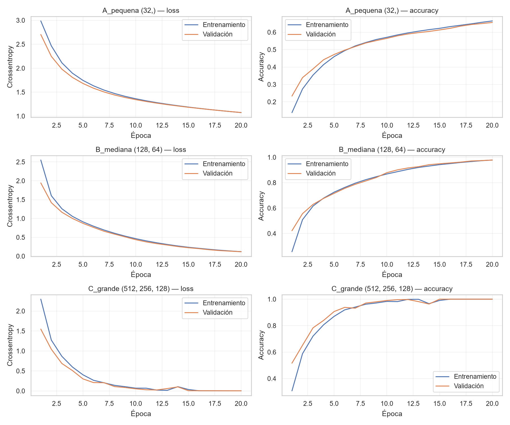

# Aporte de Jenaro: modelo y entrenamiento MLP

## Diseño y protocolo

Referencia: actividades 1.4.3 y 1.4.4 de clases. Tres capacidades con capas Dense/ReLU y 24 salidas softmax. Entrada: 784 píxeles divididos por 255. Etiquetas remapeadas y one-hot. Pérdida categorical_crossentropy, Adam, learning rate 0,001, batch 128, 20 épocas, sin Dropout. Semillas de partición y entrenamiento: 42. Train: 21.964; validación: 5.491; test oficial reservado: 7.172.

Se compara el modelo de la última época. Selección por F1 macro de validación; en empate exacto, menor loss de validación y menor número de parámetros. Solo una corrida por arquitectura. La interpretación de diferencias pequeñas necesita cautela.

## Comparación de validación

| Modelo | Capas | Parámetros | Accuracy train | Accuracy val | F1 macro val | Loss val | Segundos fit |
| --- | --- | ---: | ---: | ---: | ---: | ---: | ---: |
| C_grande | (512, 256, 128) | 569240 | 1.0000 | 1.0000 | 1.0000 | 0.0024 | 31.5 |
| B_mediana | (128, 64) | 110296 | 0.9834 | 0.9780 | 0.9790 | 0.1178 | 10.4 |
| A_pequena | (32,) | 25912 | 0.6735 | 0.6560 | 0.6556 | 1.0748 | 10.8 |

## Lectura de curvas

**C_grande**: la pérdida de entrenamiento pasó de 2.2967 a 0.0019 y la de validación de 1.5473 a 0.0024. El mínimo de validación fue 0.0024 en la época 20. Con los pesos finales, la diferencia train menos validación fue 0.00 puntos porcentuales.

**B_mediana**: la pérdida de entrenamiento pasó de 2.5494 a 0.1193 y la de validación de 1.9428 a 0.1178. El mínimo de validación fue 0.1178 en la época 20. Con los pesos finales, la diferencia train menos validación fue 0.54 puntos porcentuales.

**A_pequena**: la pérdida de entrenamiento pasó de 2.9865 a 1.0730 y la de validación de 2.7030 a 1.0748. El mínimo de validación fue 1.0748 en la época 20. Con los pesos finales, la diferencia train menos validación fue 1.75 puntos porcentuales.

### Interpretación de la corrida de referencia

Con el protocolo registrado, A mantiene pérdidas mayores y ambas curvas aún descienden al terminar: muestra aprendizaje insuficiente con este presupuesto, compatible con subajuste, pero no permite separar por sí solo falta de capacidad de falta de épocas. B reduce mucho más ambas pérdidas y C se aproxima a cero. En las curvas de esta corrida no aparece una subida sostenida de val_loss mientras train_loss baja. Eso no demuestra ausencia de problemas de generalización fuera de la validación interna. Si se cambian los parámetros o se obtienen otras curvas, debe revisarse esta interpretación.

C tiene 5.16 veces los parámetros de B. La comparación debe considerar ese costo además del beneficio en validación; el criterio acordado en este experimento prioriza F1 macro, no latencia ni tamaño del modelo.

## Selección

Se selecciona **C_grande**, capas (512, 256, 128), con 569,240 parámetros. Su F1 macro de validación es **1.0000** y su accuracy de validación es **100.00%**. Esta elección aplica el criterio fijado antes de entrenar. No usa resultados de test ni implica que sea la arquitectura óptima para cualquier semilla o conjunto de imágenes.

## Límites y entrega a Jason

Aplanar conserva los valores de los píxeles, pero las capas densas no usan filtros de vecindad espacial. El resultado de validación no demuestra desempeño en personas nuevas, fondos nuevos o señas en movimiento. El test se consulta solo después de elegir el modelo. El análisis de errores y las conclusiones del equipo corresponden a Jason.

Modelo local: `models/jenaro_mlp.keras`. Mapeo, versiones y huellas: `jenaro_entrenamiento.json`. Recarga del modelo comprobada sobre 128 imágenes de validación. El modelo y los CSV no se versionan; pueden regenerarse ejecutando el notebook.

## Reproducción y fuentes

Ejecutar desde cero `notebooks/02_sign_language_mnist_mlp_jenaro.ipynb` con los CSV en `data/raw/`. Ver README y `requirements-jenaro.txt` para el entorno probado. Los historiales por época y la tabla CSV se exportan en `reports/`.

Material docente: `1.4.4_Notebook_Modelo_Keras_Metricas_Estudiante.ipynb` (one-hot, arquitecturas, curvas); `1.4.3_Diseño_Evaluacion_Modelos_Fully_Connected_Estudiante.ipynb` (Keras, optimizadores, comparación); perceptrón, redes fully connected y descenso del gradiente (fundamentos). Los originales no se modifican. Resultados calculados mediante la ejecución local; Jenaro debe revisar y poder explicar las decisiones en la defensa.

## Comprobación posterior en el test oficial

El modelo seleccionado obtiene **79.71% de accuracy en test** y **0.7760 de F1 macro**, frente a 100.00% de accuracy en validación. La diferencia validación menos test es de **20.29 puntos porcentuales**. Esta comparación permite valorar cuánto se mantiene el desempeño al pasar al test oficial. En la corrida de referencia, la caída muestra que la validación interna ofrece una estimación optimista del desempeño en ese test. No se puede atribuir la causa solo a sobreajuste, personas distintas o fondos distintos sin investigar los datos. Se conserva la selección previa y no se vuelve a ajustar usando este test. El análisis detallado de clases y ejemplos queda para Jason.
